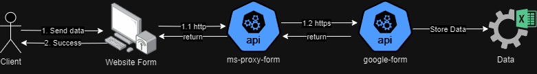

# Landing Page

Este projeto é uma landing page desenvolvida com React, com finalidade de capturar leads para o serviço de Desenvolvimento de Sistemas

## Como Iniciar

Siga os passos abaixo para configurar e iniciar o projeto em seu ambiente de desenvolvimento local:

### Pré-requisitos

- Node.js instalado na sua máquina.
- Gerenciador de pacotes npm ou yarn.

### Instalação

1. Clone o repositório para sua máquina local usando `git clone [URL do Repositório]`.
2. Navegue até o diretório do projeto e instale as dependências com `npm install` ou `yarn`.
3. Inicie o servidor de desenvolvimento executando `npm start` ou `yarn start`.
4. Abra `http://localhost:3000` em seu navegador para ver a aplicação rodando.

## Estrutura do Projeto

A aplicação é organizada da seguinte maneira:

- **`src/componentes`**: Contém todos os componentes reutilizáveis, como botões, diálogos, campos de texto, formulários, entre outros.
- **`src/services`**: Serviços para interações de API, incluindo a lógica para submissão de formulários e comunicação com back-end.
- **`src/helpers`**: Funções auxiliares para tarefas como validação de formulários.
- **`public`**: Arquivos estáticos (imagens, ícones) e `index.html`.